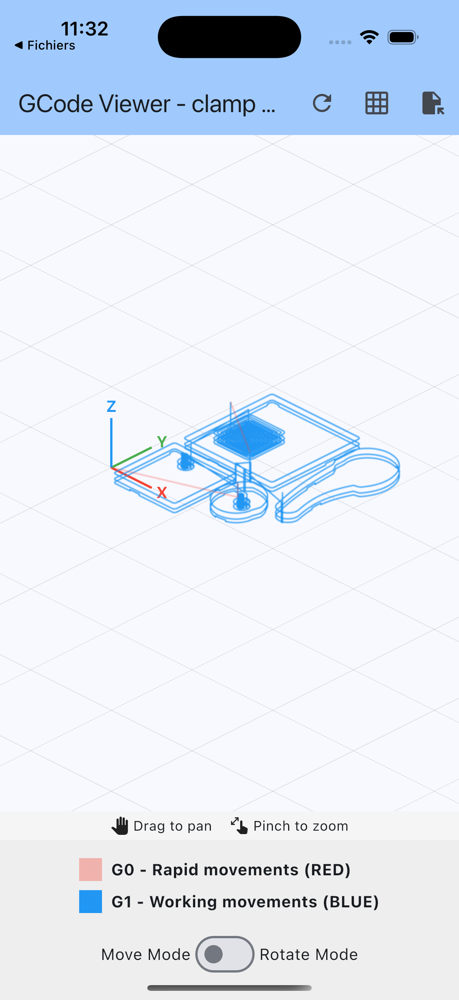
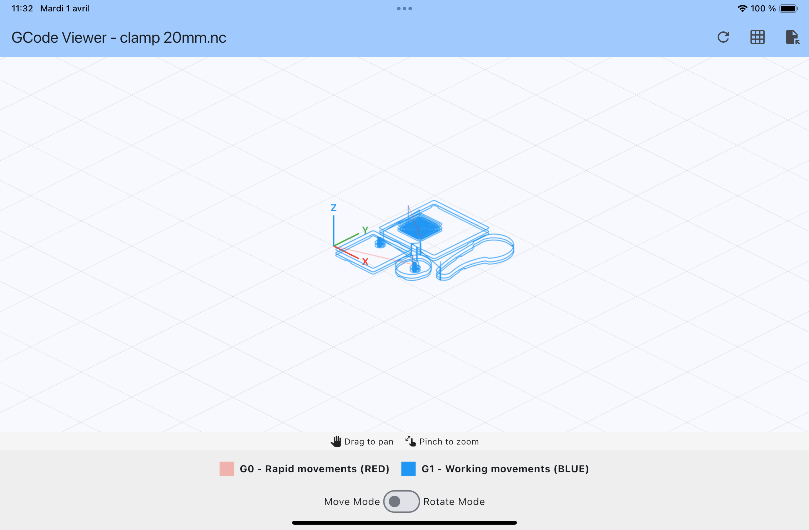
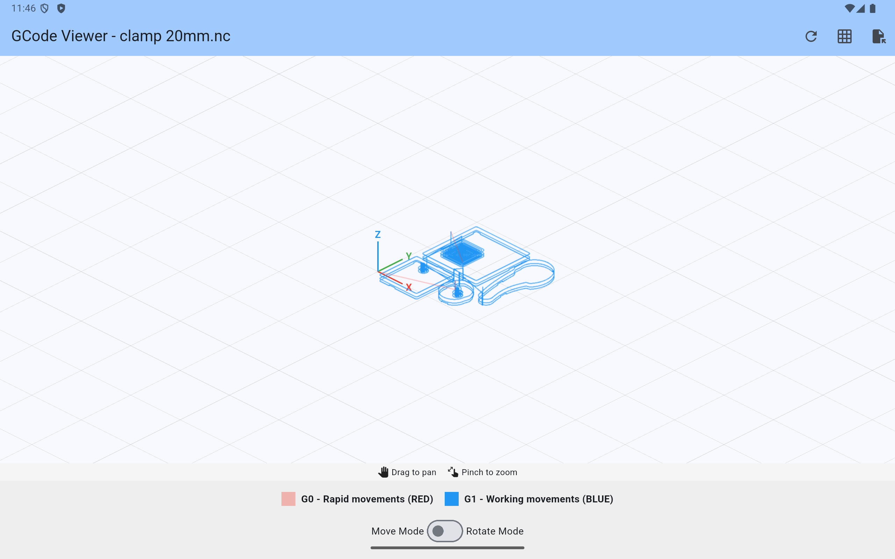
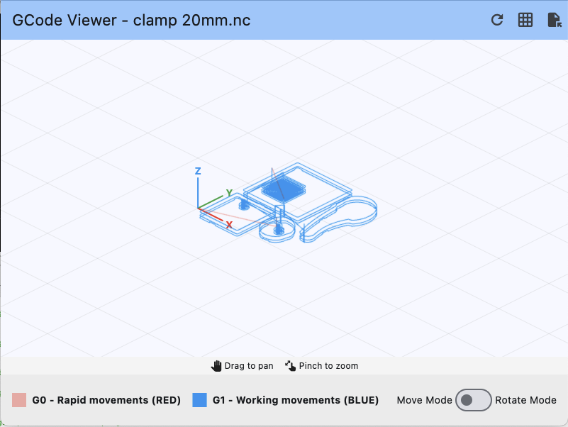

# G-code Viewer

[](https://pub.dev/packages/gcode_view)

A Flutter widget for visualizing G-code paths in 3D with interactive controls.

## Features

- Visualize G-code toolpaths in 3D space
- Distinguish between cutting and travel moves with different colors
- Interactive pan and zoom functionality
- Support for G-code arcs (G2/G3)
- Optional grid display
- Customizable colors and line thickness
- Supports millimeters and inches
- Two interaction modes: move (pan/zoom) and rotate
- Configurable performance settings

## Requirements

- Flutter SDK
- Android NDK version 27.0.12077973 or higher (required by file_picker plugin)

## Screenshots

### iOS


### iPad


### Android


### macOS


## Installation

Add `gcode_view` as a dependency in your `pubspec.yaml` file:

```yaml
dependencies:
  gcode_view: ^0.0.1
```

## Usage

Import the package:

```dart
import 'package:gcode_view/gcode_view.dart';
```

Use the widget in your Flutter application:

```dart
// Sample G-code string
final String gcode = """
G0 X0 Y0 Z10
G1 Z0 F100
G1 X10 Y0 F200
G1 X10 Y10
G1 X0 Y10
G1 X0 Y0
G0 Z10
""";

// In your build method
GcodeViewer(
  gcode: gcode,
  isRotationMode: false, // true for rotation mode, false for move mode
  cutColor: Colors.blue,
  travelColor: Colors.grey,
  pathThickness: 2.0,
)
```

### Using a controller

You can use a controller to programmatically reset the view:

```dart
final controller = GcodeViewerController();

// Later in your code
GcodeViewer(
  gcode: gcode,
  controller: controller,
)

// To reset the view to initial position
ElevatedButton(
  onPressed: () => controller.resetView(),
  child: Text('Reset View'),
)
```

### Complete example

```dart
import 'package:flutter/material.dart';
import 'package:gcode_view/gcode_view.dart';

void main() {
  runApp(const MyApp());
}

class MyApp extends StatelessWidget {
  const MyApp({super.key});

  @override
  Widget build(BuildContext context) {
    return MaterialApp(
      title: 'G-code Viewer Demo',
      theme: ThemeData(
        colorScheme: ColorScheme.fromSeed(seedColor: Colors.blue),
        useMaterial3: true,
      ),
      home: const MyHomePage(title: 'G-code Viewer Demo'),
    );
  }
}

class MyHomePage extends StatefulWidget {
  const MyHomePage({super.key, required this.title});

  final String title;

  @override
  State<MyHomePage> createState() => _MyHomePageState();
}

class _MyHomePageState extends State<MyHomePage> {
  final controller = GcodeViewerController();
  bool isRotationMode = false;
  
  // Sample G-code
  final String gcode = """
  G0 X0 Y0 Z10
  G1 Z0 F100
  G1 X50 Y0 F200
  G1 X50 Y50
  G1 X0 Y50
  G1 X0 Y0
  G0 Z10
  G0 X10 Y10
  G1 Z0
  G2 X30 Y30 I20 J0
  G0 Z10
  """;

  @override
  Widget build(BuildContext context) {
    return Scaffold(
      appBar: AppBar(
        title: Text(widget.title),
        actions: [
          IconButton(
            icon: const Icon(Icons.refresh),
            onPressed: () => controller.resetView(),
            tooltip: 'Reset View',
          ),
        ],
      ),
      body: Column(
        children: [
          // Mode selector
          Padding(
            padding: const EdgeInsets.all(8.0),
            child: Row(
              mainAxisAlignment: MainAxisAlignment.center,
              children: [
                const Text('Move Mode'),
                Switch(
                  value: isRotationMode,
                  onChanged: (value) {
                    setState(() {
                      isRotationMode = value;
                    });
                  },
                ),
                const Text('Rotate Mode'),
              ],
            ),
          ),
          // G-code viewer
          Expanded(
            child: GcodeViewer(
              gcode: gcode,
              isRotationMode: isRotationMode,
              controller: controller,
              cutColor: Colors.blue,
              travelColor: Colors.grey.withOpacity(0.5),
              pathThickness: 2.5,
              showGrid: true,
              config: const GcodeViewerConfig(
                useLevelOfDetail: true,
                usePathCaching: true,
                maxPointsToRender: 10000,
                preserveSmallFeatures: true,
                smallFeatureThreshold: 5.0,
                zoomSensitivity: 0.5,
                arcDetailLevel: 1.0,
              ),
            ),
          ),
        ],
      ),
    );
  }
}
```

## Customization

The `GcodeViewer` widget accepts several parameters for customization:

| Parameter | Type | Default | Description |
|-----------|------|---------|-------------|
| `gcode` | String | required | The G-code string to parse and display |
| `isRotationMode` | bool | required | Whether the viewer is in rotation mode (true) or movement mode (false) |
| `controller` | GcodeViewerController? | null | Optional controller to programmatically interact with the viewer |
| `pathThickness` | double | 2.5 | The thickness of the path lines |
| `cutColor` | Color | Colors.lightBlue | The color of the cutting moves |
| `travelColor` | Color | Colors.grey | The color of the travel moves |
| `gridColor` | Color | Colors.black12 | The color of the grid lines |
| `showGrid` | bool | true | Whether to display the grid |
| `isMillimeters` | bool | true | Whether the units are millimeters (true) or inches (false) |
| `config` | GcodeViewerConfig? | null | Configuration for performance and rendering options |

### Configuration Options

The `GcodeViewerConfig` class allows you to customize various aspects of the viewer's behavior:

| Parameter | Type | Default | Description |
|-----------|------|---------|-------------|
| `useLevelOfDetail` | bool | true | Whether to use level-of-detail rendering based on zoom |
| `usePathCaching` | bool | true | Whether to use path caching for better performance |
| `maxPointsToRender` | int | 10000 | Maximum points to render at once for performance (0 = no limit) |
| `preserveSmallFeatures` | bool | true | Whether to enable enhanced small feature detection |
| `smallFeatureThreshold` | double | 5.0 | Threshold in mm below which features are considered "small" |
| `zoomSensitivity` | double | 0.5 | Controls the sensitivity of zooming gestures |
| `arcDetailLevel` | double | 1.0 | Detail level for arc rendering |

## License

This project is licensed under the MIT License - see the LICENSE file for details.
